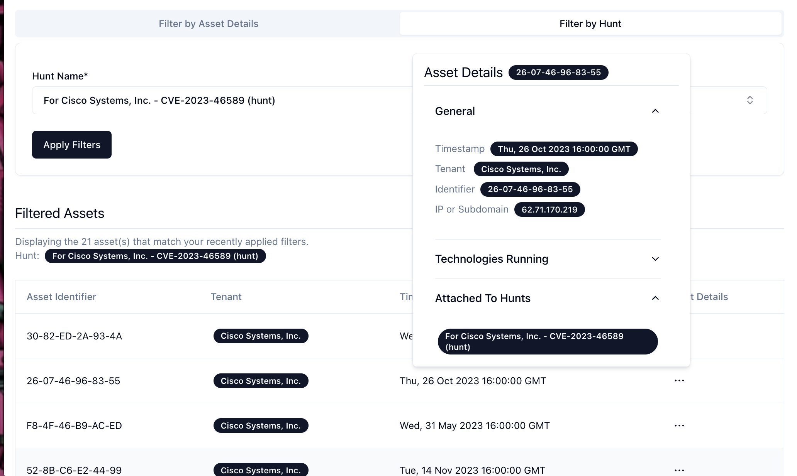
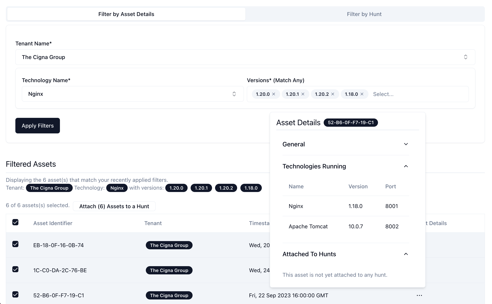
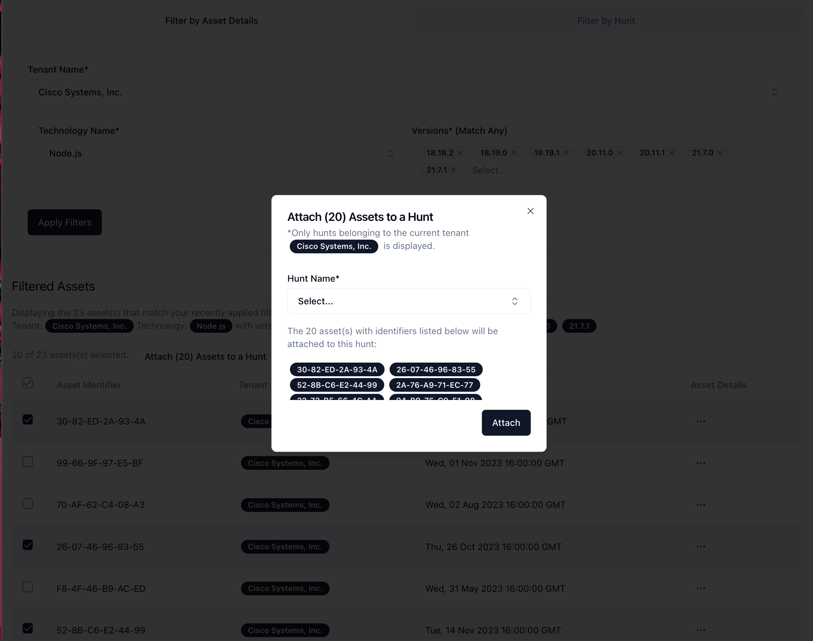
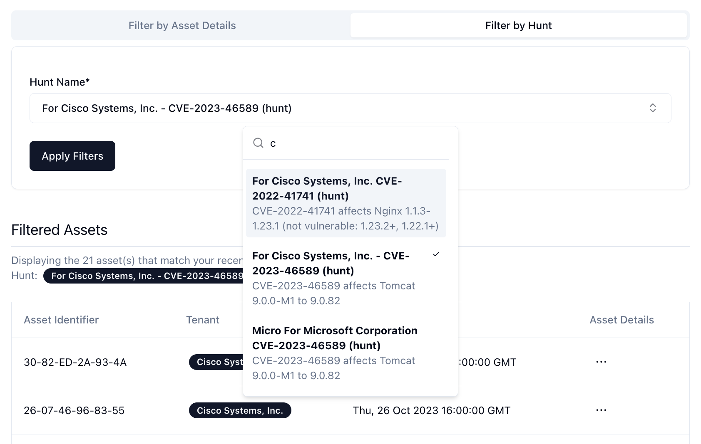

# Hunts User Interface

## Screenshots






## How to Run

```
pnpm install
pnpm run build
pnpm run preview

http://127.0.0.1:4173/
```

## Used

- Vite - https://vitejs.dev/guide/
- React - https://react.dev/
- pnpm - https://pnpm.io/
- typescript - https://www.typescriptlang.org/
- Tanstack Table - https://tanstack.com/table/
- `useSWR` - https://swr.vercel.app/
- `CMDK 0.2.0` https://github.com/pacocoursey/cmdk, be use `0.2.0` because of this issue: https://github.com/shadcn-ui/ui/pull/2945
- Shadcn - https://ui.shadcn.com/ which is built upon https://www.radix-ui.com/
- Tailwind - https://tailwindcss.com/docs/guides/vite
- Multiselect - copied and modified from https://craft.mxkaske.dev/post/fancy-multi-select

## Mocked Routes

see `/./db/index.ts` for more information

```
// GET /api/asset-filter-parameters
// GET /api/tenants/:tenantId/assets/?technology=TECH_NAME&versions=VERSION1,VERSION2
// GET /api/hunts/:huntId/assets/
// GET /api/tenants/:tenantId/assets/:assetId/
// PUT /api/hunts/:huntId
```

## Known Issues and Limitations

- Pagination not implelmented
- The `autocomplete filter` algorithm used for `combobox.tsx` and `multiselect.tsx` is the default one, which I feel doesn't really work well. Better to use a custom one.
- Error boundaries not implemented - https://react.dev/reference/react/Component#catching-rendering-errors-with-an-error-boundary
- Text overflow (long character strings) and responsiveness not implemented
- No validation when attaching assets to specific hunts
- Form semantics and accessibility can be improved (We are not using `<form>` or `<button type="submit">`)
- There are some non-ideal implementation details in `./common/multiselect.tsx` (check the comments of that file for details) which might be related to the error below that is sometimes logged in the console but it doesn't have any user visible unexpected behavior, I haven't investigated it how to fix it.

```
filter-by-asset-details-form.tsx:127 Warning: Cannot update a component (`FilterByAssetDetailsForm`) while rendering a different component (`MultiSelect`). To locate the bad setState() call inside `MultiSelect`, follow the stack trace as described in https://reactjs.org/link/setstate-in-render
    at MultiSelect
```

- TODO: Remove `<SpinningButton />` since unused

## Previous Thoughts and ETC

- https://gist.github.com/mithi/f9fe0de62a318dcbb86faafeca40f7d6
- Prettier `npx prettier . --write`
